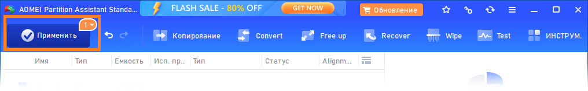
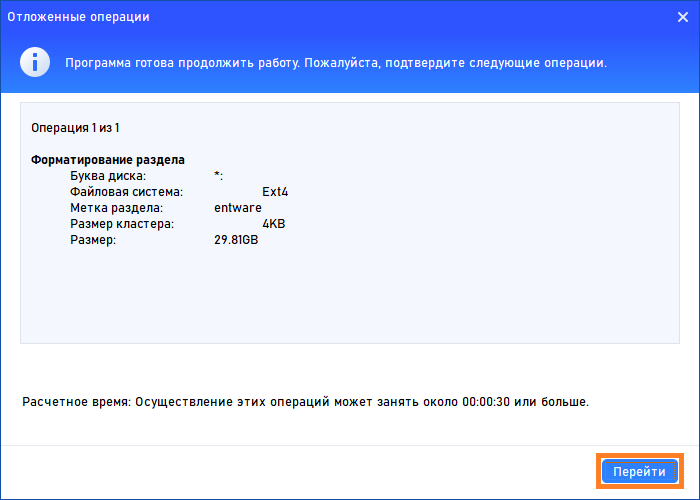
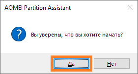
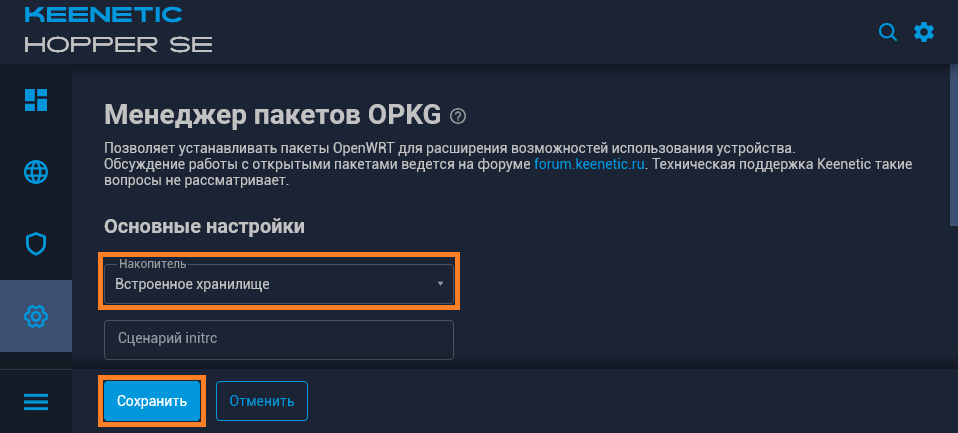
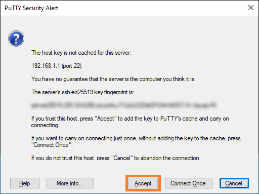

(скрипт написан исключительно для нашего любимого VPS, и не претендует на универсальность и работу с какими-либо другими конфигурациями серверов)
# Xvps - (или) настройка Xkeen в режиме диалога.

<details><summary>Для тех, кто начинает с самого начала (установка Entware)</summary>
┉┉┉┉┉┉┉┉┉┉┉┉┉┉┉┉┉┉┉┉┉┉┉┉┉┉┉┉┉┉┉┉┉┉┉┉┉┉┉┉┉┉┉┉┉┉┉┉┉┉┉┉┉┉┉┉

 ▪ Нам понадобится интернет-центр Keenetic (или ZyXel Keenetic) с USB-портом(ами) и поддержкой работы с накопителями...

> К таковым не относятся устройства: 4G II, 4G III, а также бюджетные модели 2024-го года (уточняйте поддержку соответствующих функций на сайте производителя).

▪ Для начала - нужно войти в веб-конфигуратор (попасть в него можно, набрав в адресной строке браузера):

```
my.keenetic.net
```

или адрес интернет-центра (в сегменте - к которому подключено ваше устройство). В "домашней сети" это обычно:

```
192.168.1.1
```

<details><summary>Если у вас ZyXel Keenetic (с KeeneticOS версии 2.x)</summary>
┉┉┉┉┉┉┉┉┉┉┉┉┉┉┉┉┉┉┉┉┉┉┉┉┉┉┉┉┉┉┉┉┉┉┉┉┉┉┉┉┉┉┉┉┉┉┉┉┉
 
 ▪ Открываем (в веб-конфигураторе) интерфейс командной строки, обычно это:
 
```
http://192.168.1.1/a
```

И вводим в поле "Command" одну из следующих команд:

```
components sync legacy
```

> (для KeeneticOS до версии 2.06)

```
components list legacy
```

> (для KeeneticOS версии 2.06 и выше)

▪ Нажимаем кнопку "Отправить запрос".

▪ Затем, переходим в "Управление/Параметры системы", проверяем наличие обновлений KeeneticOS, и если таковые есть - устанавливаем их...
</details>

▪ (В веб-конфигураторе) переходим в "Управление/Параметры системы", нажимаем "Изменить набор компонентов"...

<details><summary>(показать скриншот)</summary>

</details>

▪ Устанавливаем/убеждаемся, что установлен следующий компонент:

```
Поддержка открытых пакетов
```

<details><summary>(показать скриншот)</summary>

</details>

> Чтобы упростить поиск нужных компонентов в списке - можно воспользоваться полем "Поиск" (Поиск компонентов по имени)...

> Если компонент не установлен, в процессе установки - интернет-центр будет перезагружен...

▪ Теперь нужно определиться - где будет установлен Entware: во встроенном хранилище или на USB-накопителе. Нужно учитывать что: сам Entware - занимает около 8-ми MB, также понадобится свободное место для установки дополнительных пакетов...
- Встроенное хранилище - всегда с интернет-центром, не отключится (по каким-то своим причинам), не занимает USB-порт. Но - имеет существенные ограничения по объёму, и (теоретически) чувствительно к постоянной перезаписи данных (флеш-память имеет свойство изнашиваться, в связи с чем - крайне рекомендуется (по возможности) избегать ведение логов (с сохранением данных на встроенное хранилище))...
- USB-накопитель - может существенно превышать встроенное хранилище по объёму, может быть легко заменён (в случае каких-либо проблем). Но - занимает USB-порт, может быть медленнее встроенного хранилища (в зависимости от типа интерфейса/накопителя), может неожиданно оказаться отключенным (из за перегрева, механического воздействия или каких-то других причин)...
> USB-накопитель - желательно отформатировать в ext4 ( под Windows, это можно сделать с помощью бесплатной [AOMEI Partition Assistant Standard Edition](https://www.aomeitech.com/pa/standard.html). В процессе форматирования, следует задать разделу на USB-накопителе - какую-нибудь метку тома (например "entware")...

<details><summary>(показать скриншоты)</summary>









</details>

▪ Скачиваем дистрибутив Entware (подходящий для архитектуры процессора вашего интернет-центра):
- [mipsel](https://bin.entware.net/mipselsf-k3.4/installer/mipsel-installer.tar.gz)
- [mips](https://bin.entware.net/mipssf-k3.4/installer/mips-installer.tar.gz)
- [aarch64](https://bin.entware.net/aarch64-k3.10/installer/aarch64-installer.tar.gz)

> Определить, архитектуру процессора вашего устройства - не так просто (как хотелось бы)...

▪ Открываем интерфейс командной строки (обычно это):

```
http://192.168.1.1/a
```

▪ Вводим следующую команду:

```
show version
```

▪ Нажимаем кнопку "Отправить запрос"...

<details><summary>(показать скриншот)</summary>

</details>

В отчёте (об установленной версии KeeneticOS) – будет строка: "arch": "*****" (где ***** - указание на архитектуру процессора). Если архитектура: aarch64 - можно смело качать и устанавливать соответствующий дистрибутив Entware. Если: mips - придётся воспользоваться интернетом для уточнения: mips или mipsel...

<details><summary>(показать скриншот)</summary>

</details>

> Если у вас актуальная модель интернет-центра – соответствие архитектуры конкретным моделям можно посмотреть [здесь]( https://help.keenetic.ru/hc/ru/articles/360021214160.html).

▪ Переходим в "Управление/Приложения" (в веб-конфигураторе). В разделе "Диски и принтеры" - открываем накопитель (на который будем устанавливать Entware)...

<details><summary>(показать скриншот)</summary>

</details>

▪ Выделяем раздел (в дереве папок) и нажимаем кнопку "Создать папку в выделенной папке"...

<details><summary>(показать скриншот)</summary>

</details>

▪ Создаём в корне диска папку "install" (все буквы в её имени - должны быть строчными)...

<details><summary>(показать скриншот)</summary>

</details>

▪ Выделяем папку "install" и нажимаем кнопку "Загрузить файл в выбранную папку"...

<details><summary>(показать скриншот)</summary>

</details>

▪ (Находим в проводнике, выбираем и) помещаем скачанный архив (с дистрибутивом Entware) в неё...

<details><summary>(показать скриншот)</summary>

</details>

▪ Затем, переходим в "Управление/OPKG", в меню "Накопитель" - выбираем диск (на который загрузили дистрибутив Entware), и нажимаем "Сохранить"...

<details><summary>(показать скриншот)</summary>

</details>

> Дожидаемся, когда побледневшая кнопка "Сохранить" полностью исчезнет…

▪ Переходим в "Управление/Диагностика", где нажимаем "Показать журнал".

<details><summary>(показать скриншот)</summary>

</details>

▪ В журнале (одно за другим) будут появляться события (связанные с установкой и настройкой различных компонентов Entware), мы ждём события "Установка системы пакетов Entware - завершена"...

<details><summary>(показать скриншот)</summary>

</details>

<details><summary>Теперь нам понадобится ПК и PuTTY</summary>
┉┉┉┉┉┉┉┉┉┉┉┉┉┉┉┉┉┉┉┉┉┉┉┉┉┉┉┉┉┉┉┉┉┉┉┉
 
▪ [Скачиваем](http://www.putty.org/), устанавливаем и запускаем PuTTY...


▪ В поле "Host Name (or IP adress)" - вводим IP-адрес вашего маршрутизатора, обычно это:

```
192.168.1.1
```

▪ В поле "Port" - оставляем:

```
22
```

> (или вводим "222", если до установки Entware в прошивке уже был установлен компонент "Сервер SSH")

<details><summary>(показать скриншот)</summary>

</details>

▪ Нажимаем кнопку "Open"...

> (При первом подключении) появится окошко с предупреждением - в котором нужно нажать "Accept".

<details><summary>(показать скриншот)</summary>

</details>
 
▪ Откроется окно терминала. На запрос имени пользователя (login as) вводим:

```
root
```

▪ Нажимаем ввод...

▪ На запрос пароля (root@192.168.1.1's password) - вводим:

```
keenetic
```

> (при вводе пароля - символы отображаться не будут).

> Если у вас возникают сложности с вводом пароля - его можно скопировать из блокнота (или из этой инструкции) и вставить в окно терминала (кликом правой кнопки мыши)...

▪ Нажимаем "ввод"...
<details><summary>(показать скриншот)</summary>

</details>

▪ Если всё правильно - появится приглашение для ввода команд...

``
~ #
``

<details><summary>(показать скриншот)</summary>

</details>
</details>

<details><summary>Если ПК под рукой нет (но есть смартфон)</summary>
 ┉┉┉┉┉┉┉┉┉┉┉┉┉┉┉┉┉┉┉┉┉┉┉┉┉┉┉┉┉┉┉┉┉┉┉┉┉┉┉┉┉┉

 ▪ Устанавливаем ConnectBot из [GooglePlay](https://play.google.com/store/apps/details?id=org.connectbot) или [RuStore](https://www.rustore.ru/catalog/app/org.connectbot) и открываем его...

▪ Нажимаем кнопку "+" (в нижней части экрана)...

<details><summary>(показать скриншот)</summary>

</details>

▪ Нажимаем на направленную вниз галку (справа от поля)...

<details><summary>(показать скриншот)</summary>

</details>

▪ Заполняем поля "Имя пользователя", "Сервер" и "Порт" - следующими данными:

Имя пользователя:

```
root
```

Сервер - адрес вашего интернет-центра (обычно это):
```
192.168.1.1
```

Порт:

```
22
```

> (или вводим "222", если до установки Entware в прошивке уже был установлен компонент "Сервер SSH")

<details><summary>(показать скриншот)</summary>

</details>

▪ Нажимаем кнопку "Назад"...

▪ Возвращаемся к списку серверов и выбираем (добавленное) подключение...

<details><summary>(показать скриншшот)</summary>

</details>

▪ Соглашаемся "продолжить попытки соединений"...

<details><summary>(показать скриншот)</summary>

</details>

▪ Вводим пароль:

```
keenetic
```

<details><summary>(показать скриншот)</summary>

</details>

▪ Нажимаем ввод...

▪ Если всё правильно - появится приглашение для ввода команд...

``
 ~ #
 ``

<details><summary>(показать скриншот)</summary>

</details>
</details>
</details>

<details><summary>Чтобы всё правильно работало (необходимые компоненты и настройки)</summary>
Понадобятся следующие компоненты:

 - Прокси-сервер DNS-over-TLS
 - Прокси-сервер DNS-over-HTTPS
 - Протокол IPv6
- Модули ядра подсистемы Netfilter
- Пакет расширения Xtables-addons для Netfilter

> Чтобы упростить поиск нужных компонентов в списке - можно воспользоваться полем "Поиск" (Поиск компонентов по имени.) Достаточно ввести несколько букв (названия компонента)...

> Некоторые компоненты - могут не отображаться в списке, пока не будут выбраны/установлены другие...

Устанавливаем недостающие, перезагружаемся и проверяем (все ли необходимые компоненты установились)...

> Если уже установлено слишком много компонентов - новым может просто не хватать свободного места. В этом случае, придётся отключить какие-нибудь неиспользуемые компоненты...

В "Сетевые правила/Интернет-фильтры/Настройка DNS" - нужно добавить несколько DoT/DoH серверов: "Добавить сервер" (Тип сервера DNS: "DNS-over-TLS" или "DNS-over-HTTPS")...

> У автора этих строк - добавлены следующие DoT):

````
1.1.1.1
````
````
8.8.8.8
````
````
77.88.8.8
````
> Если вам известны другие DoT/DoH - можете использовать их...

<details><summary>Если у вас ZyXel Keenetic (с KeeneticOS версии 2.x)...</summary>
Чтобы компенсировать отсутствие DoT и DoH в KeeneticOS 2.x (если это необходимо) - вы можете воспользоваться пунктом "4: Предварительная настройка ZyXel Keenetic (с KeeneticOS 2.x)" (находящемся в разделе "Дополнительно", скрипта NK)...
</details>
</details>

Чтобы начать работать с Xvps, мы просто копируем следующие несколько команд (можно скопировать сразу все):
````
opkg update
opkg install ca-certificates wget-ssl
opkg remove wget-nossl
wget -O /tmp/xvps.sh https://raw.githubusercontent.com/Neytrino-OnLine/Xvps/refs/heads/main/xvps.sh
mv /tmp/xvps.sh /opt/bin/xvps
chmod +x /opt/bin/xvps

````
и вставляем их в терминал (кликом правой кнопки мыши). В приложение wget будет добавлена поддержка ssh, оно скачает скрипт Xvps, переместит его в каталог "bin" (чтобы можно было вызывать его по имени) и сделает файл исполняемым...

Теперь, можно приступать к работе...

Вводим в консоль:
```
xvps
```
и нажимаем ввод.


Появится скромное меню, в котором нужно выбрать пункт "1" и нажать ввод.
Начнётся установка Xkeen...


До определённого момента - всё будет происходить в автоматическом режиме, но потом - установщику понадобятся ответы на несколько вопросов...


(В целях экономии времени) на все вопросы мы ответим отрицательно, вы можете ответить так - как считаете нужным... После получения всех необходимых сведений - установщик выполнит все необходимые действия и завершит свою работу. Прежде - на этом месте заканчивалось всё хорошее, и начинался мучительный процесс - вникания в тонкости устройства конфигурационных *.json-файлов Xray, и попытки изменить настройки (из примеров) под свои нужды (с многочисленными сообщениями об ошибках синтаксиса и т.п.)...
Но не теперь! Нажимаем любую кнопку, и попадаем в существенно расширившееся меню Xvps.


Мы воспользуемся мастером настройки (пункт "6"), который позволит нам (в режиме диалога) поочерёдно настроить все конфигурационные файлы...


Нас приветствует мастер...


В качестве демонстрации - мы настроим самый простой вариант. Для этого: откажемся от использования политики Xkeen и добавим одно прокси-подключение на порту 1080 (без авторизации)...


По завершению этого этапа настройки, можно посмотреть - как будет выглядеть конфигурация входящих подключений в json и либо начать настройку заново, либо - утвердить результат и переходить к настройке подключений исходящих...


При настройке исходящих подключений - скрипт принимает vless-ключи (больше не нужно разбираться что есть что, или использовать дополнительные программы - разбирающие ключи на составные элементы)...


По итогам - можно (опять же) просмотреть json-версию и решить (устраивает вас результат или нужно настроить исходящие подключения заново)...


У нас самая простая конфигурация, так что в маршрутизации у нас будет только одно правило (связывающее входящее подключение с исходящим)...


И снова (по итогам) к нашим услугам json, и теперь можно сохранить всю конфигурацию... (обратите внимание: Xvps - сохраняет файлы только когда ему есть что сохранить, если прервать процесс настройки (до сохранения файлов) - это никак не повлияет на работающую в данный момент конфигурацию)
Ну и чтобы (если вдруг всё перестанет работать) была возможность быстро откатиться назад - Xvps не перезаписывает файлы предыдущей конфигурации, а перемещает их в специальную папку (откуда их можно быстро вернуть на место (если что))...


По завершению настройки - возвращаемся в главное меню Xvps, и чтобы изменения вступили в силу - выбираем пункт "2" (который штатными средствами перезапустит Xkeen). Можно пробовать подключаться к прокси (на порту 1080)...

ps.s У Xvps - есть демонстрационный режим:
```
xvps -d
```
Он позволяет пользоваться скриптом без взаимодействия с установленным Xkeen/Xray или вообще без него. В этом режиме можно сгенерировать все файлы настроек (которые будут сохранены в отдельной папке), и затем - перенести их в работающий Xkeen./Xray..
[/spoiler][/hide]
